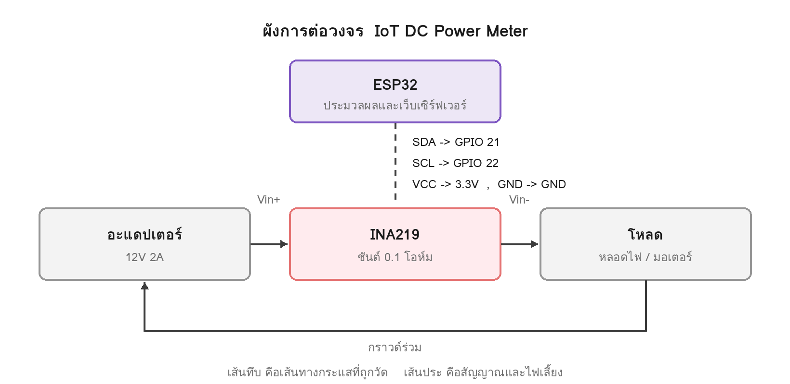

# การต่อวงจร — IoT DC Power Meter

ระบบแบ่งเป็นสองส่วน คือฝั่งสัญญาณที่ ESP32 คุยกับเซนเซอร์ผ่านบัส I2C และฝั่งไฟที่ถูกวัดซึ่งเซนเซอร์ต่ออนุกรมอยู่ในเส้นทางกระแส

---

## ฝั่งสัญญาณ — บัส I2C

| ขา INA219 | ต่อเข้า ESP32 |
|---|---|
| VCC | 3.3V |
| GND | GND |
| SDA | GPIO 21 |
| SCL | GPIO 22 |

INA219 อยู่ที่ address `0x40` ตามค่าเริ่มต้น เนื่องจากแผ่นทองแดง A0 และ A1 บนโมดูลยังไม่ถูกบัดกรีเชื่อม

---

## ฝั่งไฟที่ถูกวัด — ต่ออนุกรม

| จาก | ไปยัง |
|---|---|
| ขั้วบวกอะแดปเตอร์ | `Vin+` ของ INA219 |
| `Vin−` ของ INA219 | ขั้วบวกของโหลด |
| ขั้วลบของโหลด | ขั้วลบอะแดปเตอร์ |
| ขั้วลบอะแดปเตอร์ | GND ของ ESP32 |

---

## ข้อควรระวัง

**เซนเซอร์ต่ออนุกรม ไม่ใช่ต่อคร่อม** กระแสทั้งหมดต้องไหลผ่านตัวเซนเซอร์ หากนำไปต่อคร่อมขั้วแหล่งจ่ายเหมือนโวลต์มิเตอร์ จะเกิดการลัดวงจรผ่านตัวต้านทานชันต์ทันที

**กราวด์ต้องร่วมกัน** แรงดันคือผลต่างระหว่างสองจุดเสมอ INA219 ใช้ขา GND ของตัวเองเป็นจุดอ้างอิง ซึ่งรับไฟมาจาก ESP32 หากกราวด์ของ ESP32 ไม่ได้ต่อกับขั้วลบของแหล่งจ่าย เซนเซอร์จะวัดแรงดันของวงจรหนึ่งโดยใช้จุดอ้างอิงของอีกวงจรหนึ่ง ค่าที่ได้จะลอยและไม่ซ้ำเดิม

อาการที่พบบ่อยคือกระแสอ่านได้ปกติแต่แรงดันเพี้ยน เพราะกระแสวัดจากผลต่างคร่อมชันต์ซึ่งมีจุดอ้างอิงในตัวอยู่แล้ว ขณะที่แรงดันบัสต้องเทียบกับกราวด์ภายนอก

**จ่ายไฟ ESP32 แยกทาง USB** เพื่อไม่ให้กระแสที่ ESP32 ใช้ถูกนับรวมเข้าไปในค่าที่วัด และเพื่อไม่ให้แรงดันตกจากโหลดไปกระทบการทำงาน

**ตรวจแรงดันรางไฟก่อนเสียบเซนเซอร์** วัดระหว่างช่อง VCC กับ GND บนบอร์ดขยาย ต้องได้ราว 3.3V หากได้ 5V สายพูลอัพบน I2C จะดึงสัญญาณขึ้นเกินระดับที่ขา GPIO ของ ESP32 รับได้

---

## ขีดจำกัดของเซนเซอร์

โมดูล INA219 ที่ใช้มีตัวต้านทานชันต์ 0.1 Ω รองรับแรงดันบัสไม่เกิน 26V และกระแสไม่เกินราว 3.2A

หากต้องวัดกระแสสูงกว่านี้ ต้องเปลี่ยนค่าชันต์และแก้ค่าคาลิเบรตในโค้ดตามไปด้วย

---

## ลำดับการต่อ

1. ถอดไฟทั้งหมดออกก่อน
2. ต่อฝั่งสัญญาณสี่เส้น เสียบ USB แล้วดู Serial Monitor ว่าสแกนเจอ `0x40`
3. ถอดไฟ ต่อฝั่งอะแดปเตอร์และโหลด
4. ต่อสายกราวด์ร่วม
5. เสียบ USB ก่อน แล้วจึงเสียบอะแดปเตอร์
6. เปิดหน้าเว็บ ตรวจว่าแรงดันและกระแสขึ้นตามที่คาด
